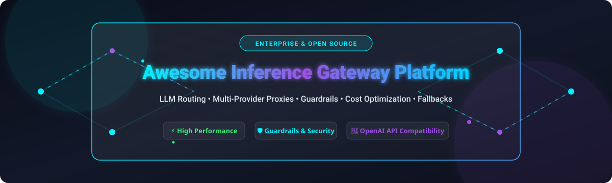

# 🚀 Awesome Inference Gateway Platform

      

---

## 💡 Overview & Ecosystem

Welcome to the **Awesome Inference Gateway Platform** repository—a comprehensive, curated directory of top-tier **SaaS AI platforms** and **open-source AI gateway proxies** for Large Language Model (LLM) traffic routing, cost tracking, security guardrails, semantic caching, and unified OpenAI-compatible API proxying.

**Inference Gateways** (also known as **AI Gateways** or **LLM Proxies**) function as intelligent infrastructure intermediaries sitting between your software applications and multi-provider AI deployments (OpenAI, Anthropic, Google Gemini, Mistral, Llama 3, AWS Bedrock, Hugging Face, etc.). They normalize API requests, enforce user/virtual token budgets, manage automatic model failovers, execute prompt guardrails, and aggregate telemetry.

---

## 📚 Table of Contents

- [🌐 SaaS / Hosted AI Gateway Platforms](#-saas--hosted-ai-gateway-platforms)
- [🔓 Open-Source GitHub Projects](#-open-source-github-projects)
- [🛠️ Key Features & Architecture Patterns](#️-key-features--architecture-patterns)
- [🤝 How to Contribute](#-how-to-contribute)
- [📈 Star History](#-star-history)
- [💖 Support & Sponsorship](#-support--sponsorship)
- [⚠️ Disclaimer](#️-disclaimer)

---

## 🌐 SaaS / Hosted AI Gateway Platforms

📊 **Market Size & Landscape**: The global AI Gateway & LLM Infrastructure market is estimated at **$2.4 Billion** and is projected to exceed **$12.5 Billion by 2030** (growing at a 38% CAGR). The sector is currently **highly fragmented**, driven by aggressive innovation among specialized AI infra startups (Portkey, OpenRouter, LiteLLM), cloud hyperscalers/CDNs (Cloudflare, NVIDIA), and incumbent API management vendors (Kong, APISIX, Solo.io).

*Note: The table below is sorted by **Company Size / Valuation / Market Capitalization** in descending order.*

| SaaS Platform 🏢 | Company Size / Valuation 💰 | Starting Price 🏷️ | Free Tier / Trial Limits 🎁 | Key Features & Description 📋 |
| :--- | :--- | :--- | :--- | :--- |
| **[NVIDIA (NIM / Dynamo)](https://www.nvidia.com/)** | **$3.0 Trillion** (Market Cap) | $1.00 / GPU-hour ($4,500/GPU/yr) | 1,000 free credits (NVIDIA Build API) | Enterprise AI inference microservices, optimized GPU throughput & NIM container proxying. |
| **[Cloudflare AI Gateway](https://developers.cloudflare.com/ai-gateway/)** | **$125 Billion** (Market Cap) | $5.00 / month (Workers Paid) | 100,000 requests / day free forever | Edge-native AI gateway with low-latency caching, rate limiting, and real-time observability across major providers. |
| **[GroqCloud](https://groq.com/)** | **$2.8 Billion** (Valuation) | $0.05 / 1M input tokens | 14,400 requests / day (30 RPM rate limit) | Ultra-low-latency LPU inference cloud and proxy gateway for open models. |
| **[Kong AI Gateway](https://konghq.com/)** | **$2.0 Billion** (Valuation) | $250.00 / month (Konnect Plus) | 125,000 requests / month free forever | Enterprise API gateway platform with AI proxying, prompt security, and semantic caching. |
| **[Together AI](https://www.together.ai/)** | **$1.25 Billion** (Valuation) | $0.20 / 1M tokens | $25.00 free credit on sign-up | High-performance AI inference cloud and API gateway for open and proprietary models. |
| **[Gloo AI Gateway (Solo.io)](https://www.solo.io/)** | **$1.0 Billion** (Valuation) | $1,200.00 / cluster / year | 30-day free trial (full enterprise access) | Envoy-based Kubernetes gateway extended for LLM traffic routing, prompt protection, and MCP connectivity. |
| **[Fireworks AI](https://fireworks.ai/)** | **$550 Million** (Valuation) | $0.20 / 1M tokens | $1.00 free credit (~5M tokens) | Ultra-fast serverless inference platform and OpenAI-compatible multi-model gateway. |
| **[Baseten](https://www.baseten.co/)** | **$230 Million** (Valuation) | $0.0002 / second ($0.72 / hour T4) | $30.00 free inference credit on sign-up | Custom model serving platform with integrated gateway routing, auto-scaling, and fallback controls. |
| **[Portkey](https://portkey.ai/)** | **$140 Million** (Valuation) | $49.00 / month (Pro Plan base) | 10,000 requests/logs / month free forever | Full-stack LLM gateway and control plane with prompt management, guardrails, and 1,600+ model routing. |
| **[Gravitee AI Gateway](https://www.gravitee.io/)** | **$100 Million** (Valuation) | $650.00 / month (Enterprise tier) | 14-day free trial (unlimited local dev) | API management platform extended with GenAI policies, token rate limits, and multi-provider failover. |
| **[TrueFoundry AI Gateway](https://www.truefoundry.com/)** | **$40 Million** (Valuation) | $100.00 / month (Developer Plan) | 14-day free trial ($50 infra credits) | Internal developer platform and governance gateway for routing LLMs across hybrid and multi-cloud setups. |
| **[OpenRouter](https://openrouter.ai/)** | **$30 Million** (Valuation) | $0.05 / 1M tokens (pay-per-token) | 20+ free models (200 req/min limit) | Unified API marketplace and router delivering pay-as-you-go access to hundreds of proprietary and open LLMs. |
| **[Zuplo AI Gateway](https://zuplo.com/)** | **$25 Million** (Valuation) | $25.00 / month (Edge Plan) | 100,000 requests / month free forever | OpenAPI-native edge API gateway featuring AI rate-limiting, key management, and prompt routing. |

---

## 🔓 Open-Source GitHub Projects

Open-source inference gateways empower engineering teams to host unified OpenAI-compatible proxies in their own VPC or Kubernetes clusters, guaranteeing complete data privacy, zero vendor markup, and custom routing logic.

*Note: The open-source repositories below are sorted by **GitHub Star Count** in descending order.*

1. **[vLLM](https://github.com/vllm-project/vllm)**   
   High-throughput, memory-efficient LLM serving engine featuring PagedAttention and a built-in OpenAI-compatible API gateway proxy for serving open-weights models.

2. **[LiteLLM](https://github.com/BerriAI/litellm)**   
   Leading open-source LLM proxy gateway delivering a standardized OpenAI format across 100+ model providers with virtual key management, budget enforcement, load balancing, and fallbacks.

3. **[Kong Gateway (OSS)](https://github.com/Kong/kong)**   
   The world's most deployed open-source API gateway, featuring specialized AI plugins for multi-LLM proxying, prompt transformation, token rate limiting, and semantic caching.

4. **[Apache APISIX](https://github.com/apache/apisix)**   
   High-performance cloud-native API gateway equipped with AI plugins for LLM routing, token metric tracking, semantic caching, and dynamic failovers at enterprise scale.

5. **[Portkey Gateway (OSS Core)](https://github.com/Portkey-AI/gateway)**   
   Ultra-fast, open-source AI gateway core designed for unified LLM routing, automatic retries, fallback strategies, and low-latency API proxying across 1,600+ models.

6. **[Text Generation Inference (TGI)](https://github.com/huggingface/text-generation-inference)**   
   Hugging Face's battle-tested solution for deploying and serving open LLMs with built-in token streaming, batching, and gateway endpoints.

7. **[Tyk Gateway (OSS)](https://github.com/TykTechnologies/tyk)**   
   Open-source API gateway providing security, developer developer rate-limiting, and policy controls for proxying LLM requests in microservices environments.

8. **[Higress AI Gateway](https://github.com/higress-group/higress)**   
   Next-generation cloud-native AI gateway built on Envoy and Istio, supporting AI proxying, protocol translation, dynamic fallbacks, and Wasm plugins.

9. **[Helicone](https://github.com/Helicone/helicone)**   
   Open-source observability platform and gateway proxy for tracking LLM token costs, prompt latency, feedback loops, and response caching.

10. **[Envoy AI Gateway](https://github.com/envoyproxy/ai-gateway)**   
    Official Envoy Proxy project extension dedicated to GenAI traffic routing, Kubernetes-native Gateway API specs, and multi-provider load balancing.

---

## 🛠️ Key Features & Architecture Patterns

Modern production-grade Inference Gateways fulfill key capabilities across the GenAI stack:

- 🔄 **Unified API Normalization**: Expose a single OpenAI-compatible `/v1/chat/completions` endpoint while translating requests to Anthropic Claude, Google Gemini, Cohere, or local vLLM instances.
- 🔀 **Smart Dynamic Routing & Load Balancing**: Route incoming traffic based on latency, model availability, context length requirements, or price performance.
- 🛡️ **Guardrails & Security**: Inspect prompts and outputs for PII leaks, prompt injection attacks, jailbreaks, and toxic content before reaching models or users.
- ⚡ **Semantic Caching**: Store prompt embeddings in Redis or vector databases to instantly return cached answers for duplicate/similar queries, slashing latency and API bills.
- 💰 **Budget & Rate-Limiting Controls**: Assign virtual API keys to developers or internal teams with strict monthly budget caps and RPM/TPM limits.

---

## 🤝 How to Contribute

Contributions are highly welcome! Please follow these simple steps to contribute:

1. Fork the repository on GitHub.
2. Add your new SaaS platform or Open-Source project to the appropriate section (ensure correct sorting and format).
3. Follow the repository format carefully: include platform name, link, pricing details, and factual descriptions.
4. Reference the main list guidelines at [Awesome-Awesome-Awesome](https://github.com/ishandutta2007/Awesome-Awesome-Awesome).
5. Submit a Pull Request with a short summary of your addition.

---

## 📈 Star History

---

## 💖 Support & Sponsorship

If you find this curated list of **Inference Gateway Platforms** useful, please consider supporting the project:

- 🌟 **Star this repository** on GitHub to show your appreciation!
- 🔀 **Fork it** and contribute improvements to keep the ecosystem updated.
- 📢 **Share this repository** with your colleagues, MLOps team, and developer communities.
- ☕ **Sponsor the Maintainer**: Buy me a coffee or sponsor ongoing maintenance via the [GitHub Sponsor Dashboard](https://github.com/sponsors/ishandutta2007).

Thank you for being part of the open-source AI infrastructure community! ❤️

---

## ⚠️ Disclaimer

- This is a community-curated list maintained for educational and reference purposes.
- Inference gateways process API keys, prompts, and inference outputs. When deploying in production, ensure enterprise-grade secrets management, network segmentation, and compliance controls are active.
